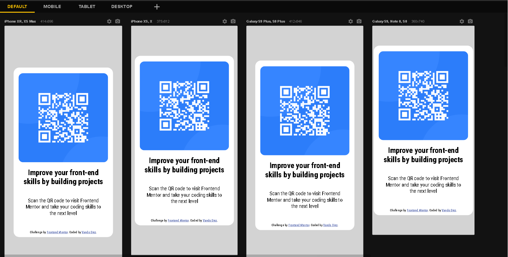

# Frontend Mentor - QR code component solution

Essa é a solução do desafio [QR code component challenge on Frontend Mentor](https://www.frontendmentor.io/challenges/qr-code-component-iux_sIO_H) do site FrontEnd Mentor! 

## Sumário

- [Visão Geral](#visão-geral)
  - [Screenshots](#screenshots)
  - [Links](#links)
  - [Autor](#autor)
- [Desenvolvimento](#desenvolvimento)
  - [Ferramentas Utilizadas](#ferramentas-utilizadas)
  - [Referêcias](#referências)

## Visão Geral

### Screenshots

### Links

- URL da Solução: [https://www.frontendmentor.io/solutions/qr-code-challenge-WxS193h5l_](https://www.frontendmentor.io/solutions/qr-code-challenge-WxS193h5l_)
- URL do Site: [https://vandodiniz.github.io/FrontendMentor-001-QRcode/](https://vandodiniz.github.io/FrontendMentor-001-QRcode/)

### Autor

- Frontend Mentor - [@vandodiniz](https://www.frontendmentor.io/profile/vandodiniz)
- Linkedin - [Vando Diniz](https://www.linkedin.com/in/vando-diniz-79b431234/)

## Desenvolvimento

### Ferramentas Utilizadas

- HTML 5 Semântico
- CSS
- Responsividade

### Referências

- [A Complete Guide to Flexbox](https://css-tricks.com/snippets/css/a-guide-to-flexbox/) - Este site me ajudou a centralizar meu conteúdo de forma mais eficiente usando o modelo Flexbox.
